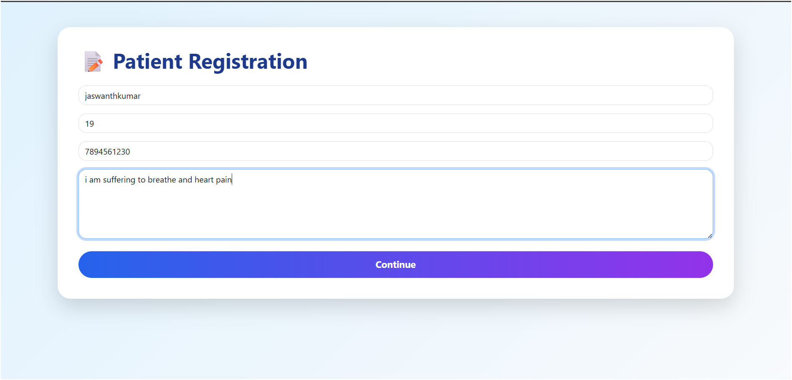
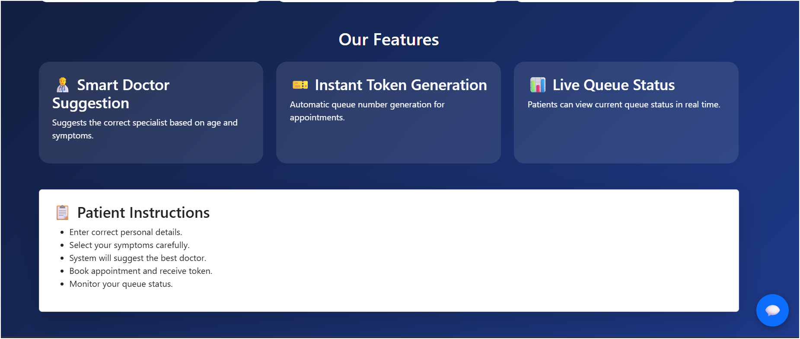
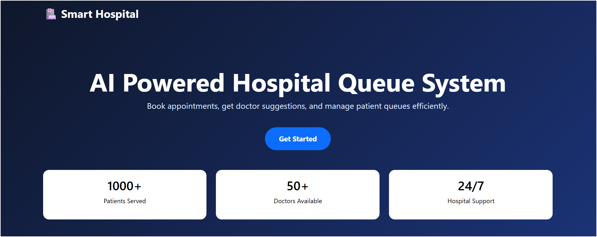
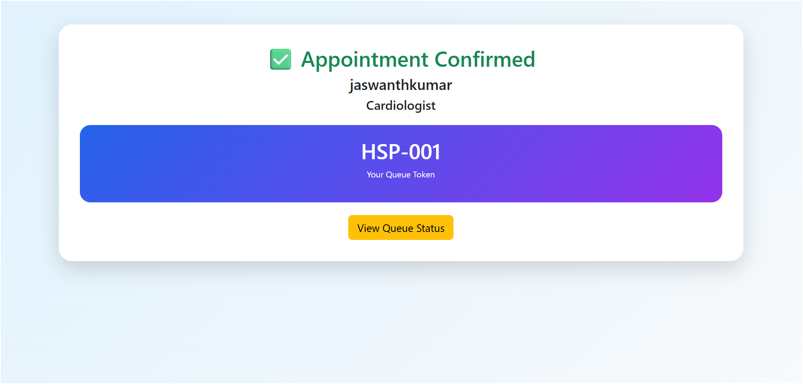
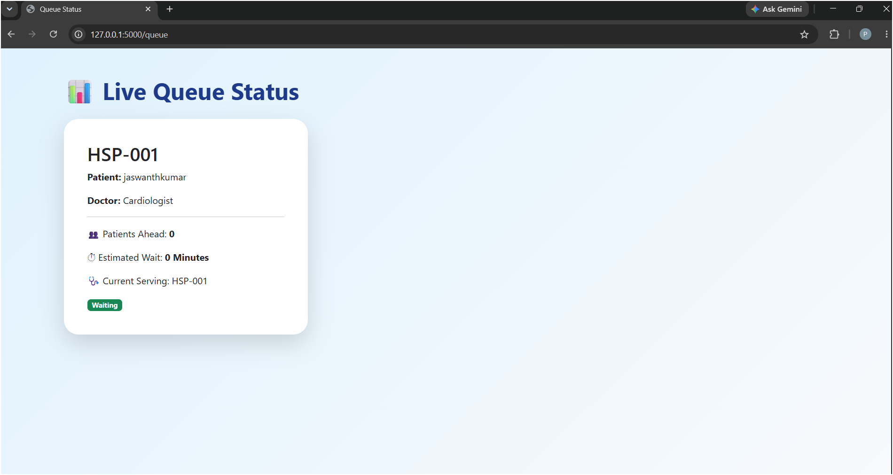
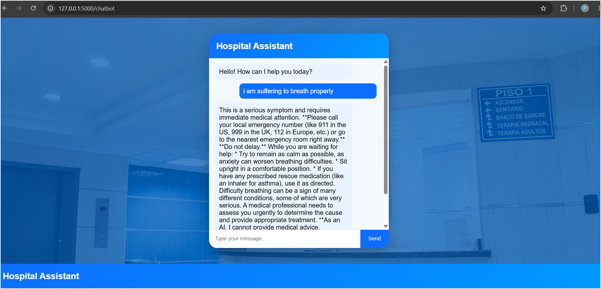

# 🏥 HospitalQueueAI

HospitalQueueAI is an AI-powered hospital appointment and queue management web application built using **Python Flask**, **HTML**, **CSS**, **JavaScript**, and **Google Gemini AI**.

The system allows patients to register, enter symptoms, receive a suggested medical department, book appointments, generate queue tokens, check their queue status, and interact with an AI chatbot.

---

## ✨ Features

### 👤 Patient Registration

Patients can provide:

- Name
- Age
- Phone number
- Symptoms

The system processes the patient's information and suggests an appropriate department.

### 🩺 Doctor / Department Recommendation

The application recommends a suitable department based on age and symptoms.

Examples:

| Symptoms | Suggested Department |
|---|---|
| Fever, cold, cough | General Physician |
| Chest or heart symptoms | Cardiologist |
| Headache or brain-related symptoms | Neurologist |
| Skin or allergy symptoms | Dermatologist |
| Eye-related symptoms | Ophthalmologist |
| Bone or joint symptoms | Orthopedic |
| Age below 16 | Pediatrician |

### 📅 Appointment Booking

Patients can book an appointment after registration.

After successful booking, the system generates a unique queue token.

Example:

```text
HSP-001
HSP-002
HSP-003
```

### 🎫 Queue Management

The queue management system provides information about the patient's position in the queue.

It displays:

- Patient name
- Queue token
- Doctor / Department
- Number of patients ahead
- Estimated waiting time

### ⏱️ Waiting Time Estimation

The application estimates the waiting time based on the number of patients ahead.

Example:

```text
Patient 1 → 0 minutes
Patient 2 → 5 minutes
Patient 3 → 10 minutes
Patient 4 → 15 minutes
```

### 🤖 AI Chatbot

The application includes an AI chatbot powered by **Google Gemini AI**.

Users can enter their symptoms and receive general informational guidance.

### 🌐 Responsive Web Interface

The application provides a clean and user-friendly interface using:

- HTML5
- CSS3
- JavaScript

The interface is designed to work across different screen sizes.

---

# 🛠️ Technologies Used

## Frontend

- HTML5
- CSS3
- JavaScript

## Backend

- Python
- Flask

## Artificial Intelligence

- Google Gemini AI
- Google Generative AI API

## Environment Management

- Python-dotenv
- `.env` environment variables

## Version Control

- Git
- GitHub

---

# 📂 Project Structure

```text
HospitalQueueAI/
│
├── Screenshots/
│   ├── ai checker.png
│   ├── book-appoinment.png
│   ├── chatbot.png
│   ├── checks-queue.png
│   ├── hospital-features.png
│   ├── hospital-form.png
│   └── registration.png
│
├── static/
│   ├── script.js
│   └── style.css
│
├── templates/
│   ├── appointment.html
│   ├── chatbot.html
│   ├── index.html
│   ├── queue.html
│   ├── register.html
│   └── success.html
│
├── .gitignore
├── app.py
└── README.md
```

---

# ⚙️ Installation and Setup

Follow the steps below to run HospitalQueueAI locally.

## Step 1: Clone the Repository

Clone the project from GitHub:

```bash
git clone https://github.com/pojjuruhepsiba/HospitalQueueAI.git
```

Navigate into the project directory:

```bash
cd HospitalQueueAI
```

---

## Step 2: Create a Virtual Environment

Create a Python virtual environment:

```bash
python -m venv venv
```

### Windows

Activate the virtual environment:

```bash
venv\Scripts\activate
```

### macOS / Linux

```bash
source venv/bin/activate
```

---

## Step 3: Install Dependencies

Install the required Python packages:

```bash
pip install flask python-dotenv google-generativeai
```

---

## Step 4: Configure Gemini API Key

HospitalQueueAI uses Google Gemini AI for the chatbot functionality.

Create a file named:

```text
.env
```

in the root project directory.

The project structure should look like:

```text
HospitalQueueAI/
│
├── .env
├── app.py
├── README.md
└── ...
```

Add your Gemini API key:

```env
GEMINI_API_KEY=YOUR_GEMINI_API_KEY
```

The application loads the API key using:

```python
import os
from dotenv import load_dotenv

load_dotenv()
```

The Gemini API is configured using:

```python
genai.configure(
    api_key=os.getenv("GEMINI_API_KEY")
)
```

---

## 🔒 API Key Security

The `.env` file is ignored by Git using `.gitignore`.

The `.gitignore` file contains:

```text
.env
```

This helps prevent the API key from being uploaded to GitHub.

> ⚠️ Never upload your `.env` file or Gemini API key to GitHub.

---

## Step 5: Run the Application

Start the Flask application:

```bash
python app.py
```

The application will run locally.

Open your browser and visit:

```text
http://127.0.0.1:5000
```

---

# 🔄 Application Workflow

The application follows this workflow:

```text
             ┌──────────────────┐
             │      Patient     │
             └────────┬─────────┘
                      │
                      ▼
             ┌──────────────────┐
             │   Registration   │
             └────────┬─────────┘
                      │
                      ▼
             ┌──────────────────┐
             │ Enter Symptoms   │
             └────────┬─────────┘
                      │
                      ▼
             ┌──────────────────┐
             │ Doctor/Department│
             │   Recommendation │
             └────────┬─────────┘
                      │
                      ▼
             ┌──────────────────┐
             │ Book Appointment │
             └────────┬─────────┘
                      │
                      ▼
             ┌──────────────────┐
             │ Generate Token   │
             └────────┬─────────┘
                      │
                      ▼
             ┌──────────────────┐
             │  Queue Tracking  │
             └────────┬─────────┘
                      │
                      ▼
             ┌──────────────────┐
             │   AI Chatbot     │
             └──────────────────┘
```

---

# 📄 Application Pages

## 🏠 Home Page

The home page provides access to the main HospitalQueueAI features.

Users can navigate to:

- Registration
- Appointment Booking
- Queue Management
- AI Chatbot

---

## 📝 Registration Page

The registration page collects:

- Name
- Age
- Phone Number
- Symptoms

After submitting the form, the system processes the patient's information and suggests an appropriate department.

---

## 🩺 Appointment Page

The appointment page displays the suggested doctor or department.

The patient can proceed with the appointment booking.

---

## 🎫 Queue Page

The queue page displays patient queue information.

It includes:

- Queue Token
- Patient Name
- Department / Doctor
- Patients Ahead
- Estimated Waiting Time

---

## 🤖 Chatbot Page

The chatbot allows users to enter symptoms and receive AI-generated general information.

The chatbot uses the Google Gemini API.

---

## ✅ Success Page

After successfully booking an appointment, the application displays:

- Appointment Successfully Booked
- Patient Name
- Doctor / Department
- Queue Token

---

# 📸 Screenshots

## 📝 Patient Registration



## 🏥 Hospital Features



## 📋 Hospital Form



## 📅 Book Appointment



## 🎫 Queue Management



## 🤖 AI Chatbot



## 🧠 AI Checker


---

# 🧪 Testing

The following application features can be tested manually.

## Patient Registration

1. Enter patient name.
2. Enter age.
3. Enter phone number.
4. Enter symptoms.
5. Submit the registration form.

## Doctor Recommendation

Test different symptoms:

- Fever
- Cold
- Cough
- Chest pain
- Headache
- Skin allergy
- Eye problem
- Joint pain

## Appointment Booking

1. Complete patient registration.
2. Check the recommended department.
3. Book the appointment.
4. Verify the generated queue token.

## Queue Management

1. Open the queue page.
2. Verify the patient token.
3. Verify the number of patients ahead.
4. Verify the estimated waiting time.

## AI Chatbot

1. Open the chatbot.
2. Enter a symptom.
3. Submit the question.
4. Verify the AI response.

---

# 🎫 Example Queue

```text
-----------------------------------------
             HOSPITAL QUEUE
-----------------------------------------

Token       Patient        Department

HSP-001     Patient 1      General Physician
HSP-002     Patient 2      Cardiologist
HSP-003     Patient 3      Neurologist

-----------------------------------------
```

---

# 🔐 Security Features

HospitalQueueAI follows basic security practices:

- API keys are stored using environment variables.
- `.env` is excluded from Git.
- Sensitive credentials are not included in source code.
- `.gitignore` prevents accidental upload of environment files.

---

# ⚠️ Medical Disclaimer

HospitalQueueAI is an educational and academic project.

The AI chatbot and doctor/department recommendation features provide general informational guidance only.

They are **not intended to provide medical diagnosis, emergency treatment, or professional medical advice**.

Patients should consult qualified healthcare professionals for medical concerns.

---

# 🚀 Future Enhancements

The following features can be added in future versions:

## 🗄️ Database

- MySQL integration
- MongoDB integration
- Persistent patient records
- Appointment history

## 👨‍⚕️ Doctor Management

- Doctor login
- Doctor dashboard
- Doctor availability
- Department management

## 👤 Patient Management

- Patient login
- Patient profile
- Appointment history
- Medical record management

## 📊 Admin Dashboard

- Total patients
- Total appointments
- Active queue
- Doctor statistics
- Department statistics
- Daily appointment analytics

## 🔔 Notifications

- Email notifications
- SMS notifications
- Appointment reminders
- Queue status notifications

## 🤖 AI Improvements

- Improved symptom classification
- Multilingual chatbot
- Voice-based chatbot
- More detailed department recommendations

## ☁️ Deployment

The application can be deployed using cloud platforms such as:

- Render
- Railway
- PythonAnywhere
- Google Cloud
- AWS

---

# 📈 Project Benefits

HospitalQueueAI helps reduce manual hospital queue management and provides a simple digital experience for patients.

### Benefits

- ⏱️ Reduced waiting confusion
- 🎫 Digital queue tokens
- 🩺 Department recommendation
- 🤖 AI-powered assistance
- 📅 Easy appointment booking
- 📱 User-friendly interface
- 🔐 Environment-based API security

---

# 🎓 Academic Project

This project was developed as an educational project to demonstrate:

- Python programming
- Flask web development
- HTML/CSS/JavaScript
- REST-style web routes
- AI API integration
- Environment variable management
- Git and GitHub
- Basic hospital workflow automation

---

# 👨‍💻 Author

## Pojjuru Hepsiba

### GitHub

[https://github.com/pojjuruhepsiba](https://github.com/pojjuruhepsiba)

### Project Repository

[HospitalQueueAI](https://github.com/pojjuruhepsiba/HospitalQueueAI)

---

# 📄 License

This project is created for educational and academic purposes.

You are free to study and modify the source code for learning purposes.

---

# ⭐ Support

If you find this project useful, you can give the repository a ⭐ on GitHub.

Thank you for checking out **HospitalQueueAI**! 🏥🤖
